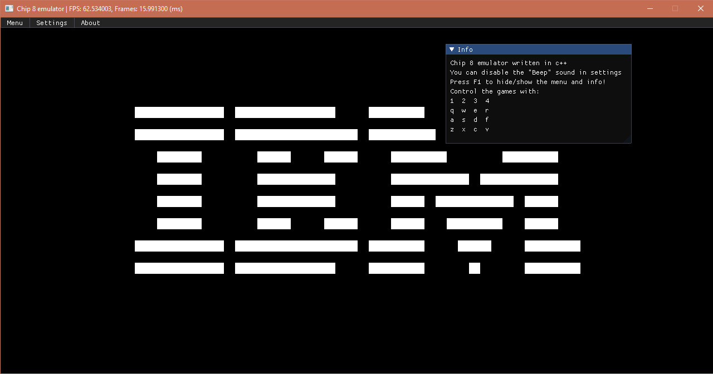
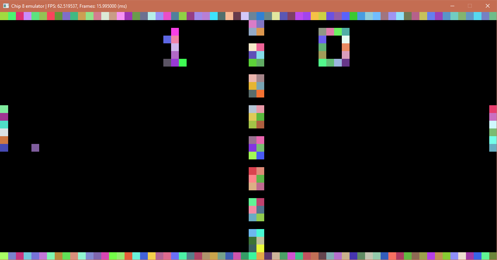

# 8-CHIP-emulator
Simple 8 chip emulator written in c++ and SDL2, powered by the following libraries:
 - [Dear ImGui](https://github.com/ocornut/imgui)
 - [imgui_sdl](https://github.com/Tyyppi77/imgui_sdl)
 - [Native File Dialog](https://github.com/mlabbe/nativefiledialog)
 ## Screenshots

======

# Credits
[omar (ocornut)](https://github.com/ocornut) for ImGui  
[Tyyppi77](https://github.com/Tyyppi77) for imgui_sdl  
[Michael Labbe](https://github.com/mlabbe) for Native File Dialog  
### Documentation
[Tobias V. Langhoff](https://github.com/tobiasvl) for [A high-level guide to making a CHIP-8 emulator](https://tobiasvl.github.io/blog/write-a-chip-8-emulator/)  
[Laurence Muller](https://github.com/falcon4ever) for [How to write an emulator (CHIP-8 interpreter)](http://www.multigesture.net/articles/how-to-write-an-emulator-chip-8-interpreter/)  
Wikipedia for [CHIP-8 opcodes and other documentation](https://en.wikipedia.org/wiki/CHIP-8#Opcode_table)
